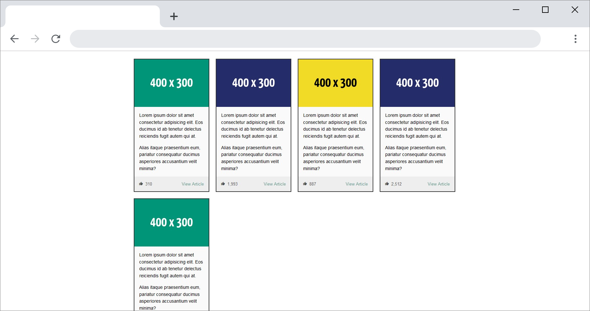

# Card design

Many website use a 'card' design to present content. Try to recreate the following design:

You can either use CSS Flexbox or CSS grid to create the layout.
Make sure the items are centered on the screen with some whitespace to the left and right.

## Report

Don't forget to fill in the [REPORT.md](REPORT.md) at the end of the exercise.
