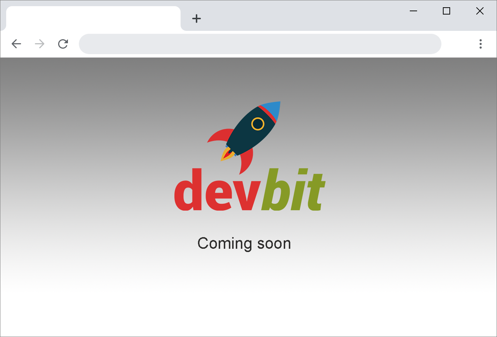

# Landing page

Create a landing page for our devbit website.
The page consists out a logo with the text "coming soon" below. The content is centered horizontally as well as vertically on the page.

Make sure the content keeps being centered independent of the size of the browser windows.

The logo is available in the `img` directory and is names `logo.png`

Tip: CSS has no straightforward way of centering content vertically on a full page. CSS Grid and / or CSS Flexbox might make it easy to center content vertically.

## Report

Don't forget to fill in the [REPORT.md](REPORT.md) at the end of the exercise.
