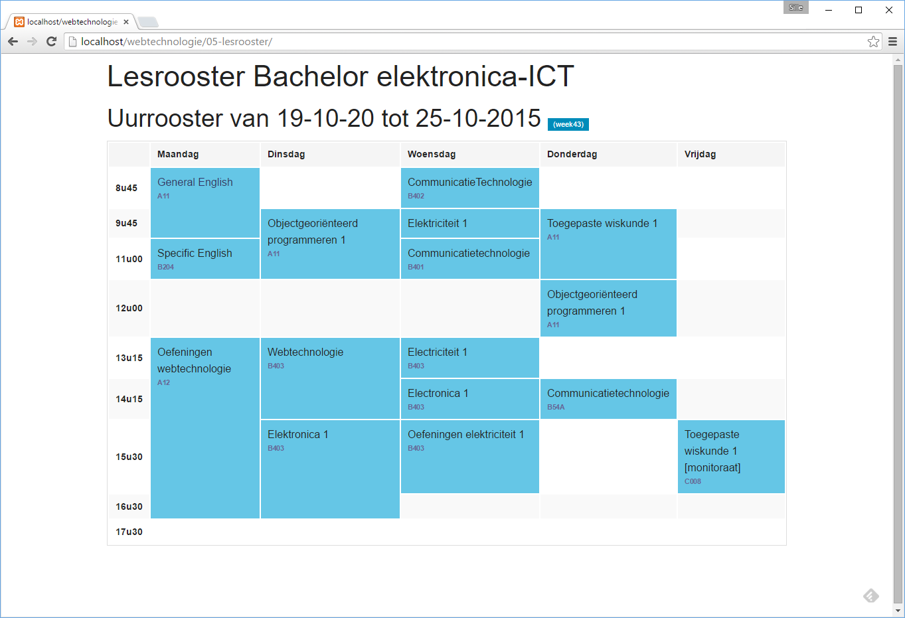

# Class schedule

Try to create a class schedule table like te screenshot below:

The schedule must not match the screenshot, just add the real schedule of the current week in your solution.

## Report

Don't forget to fill in the [REPORT.md](REPORT.md) at the end of the exercise.
