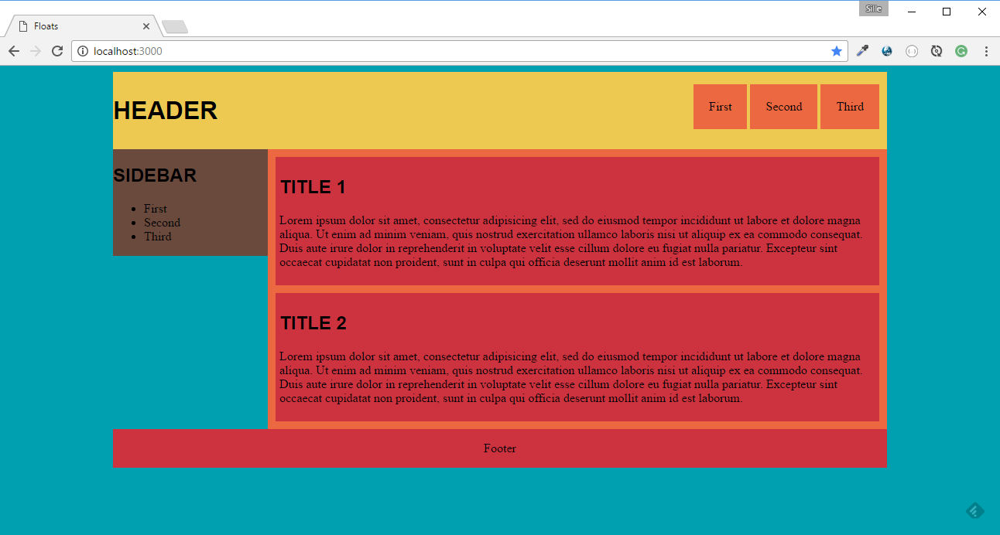

# Simple layout

Try to build a simple webpage layout structure as shown in the picture below.

Try to use meaningful HTML elements to implement the different parts.

The structure can be build using different CSS api's. CSS Flexbox or CSS grid could be used. Try to avoid using the `float` property.

## Report

Don't forget to fill in the [REPORT.md](REPORT.md) at the end of the exercise.
